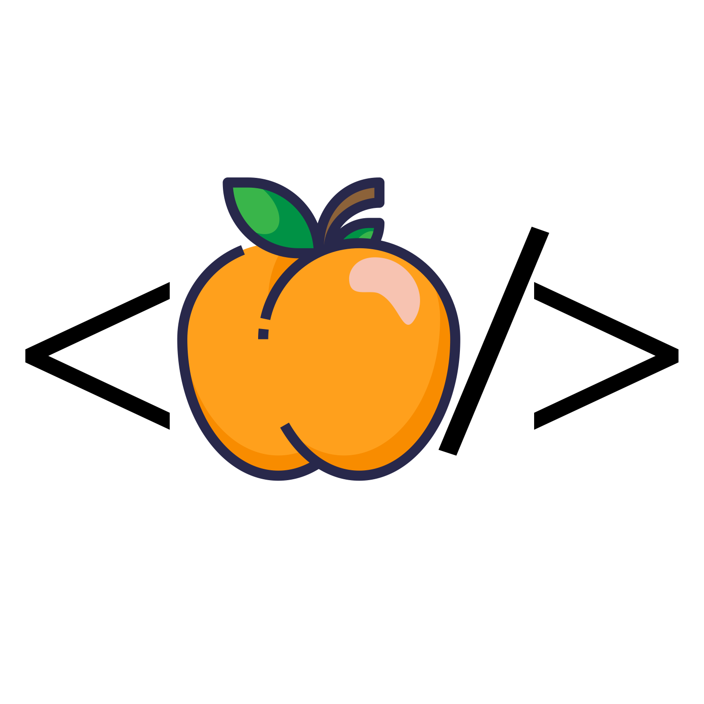

import imageCarlosOrtega from '@/images/team/carlos-ortega.jpeg'

export const article = {
  draft: false,
  date: '2022-07-13',
  title: 'We Are Open Patterson',
  description: "Announcing the launch of Open Patterson, a Code for America Brigade.",
  author: {
    name: 'Carlos E. Ortega',
    role: 'Founder / CEO',
    image: { src: imageCarlosOrtega },
  },
}

export const metadata = {
  title: article.title,
  description: article.description,
}

## Before We Introduce Ourselves

Before we can introduce ourselves, we must explain why we felt it was necessary to launch a Code for America Brigade in Patterson.

Despite being so close to the Bay Area and Silicon Valley, we have found no tech community pop up in Patterson, or Stanislaus County in general. 

As a result, we have found that the vast majority of Computer Science graduates in the area are forced to move away for more opportunities.

In turn, where other, larger, cities find themselves with thriving tech communities and folks willing to contribute their tech skills to the community, Patterson has seen none of that.

## Where We Step In

Rather than reinventing the wheel, we decided to adopt a framework and join an established network, the <a href="https://brigade.codeforamerica.org/" target="_blank">Code for America Brigade Network</a>. 

Code for America Brigades are volunteer-led groups made up of engineers, policy advocates, designers, community organizers, and folks with skills to contribute.

Despite having no tech community and very few companies using technology in the area, we do have folks with these skills. The largest community being undergraduate students with a hunger to learn and skills to contribute.

## Next Steps
We are already working on our first projects, the priority being a Better Patterson Council Website. However, we need volunteers. The more volunteers, the greater impact Open Patterson can have in Patterson, and maybe eventually in all of Stanislaus County. If you are interested in joining visit the "Join Us" tab at the top of this page. Contact <a href="mailto:carlos@openpatterson.org" target="_blank">carlos@openpatterson.org</a> if you have any questions.

Do you represent a Nonprofit or a Local Government Agency?

We'd love to work with you. Email <a href="mailto:carlos@openpatterson.org" target="_blank">carlos@openpatterson.org</a>
